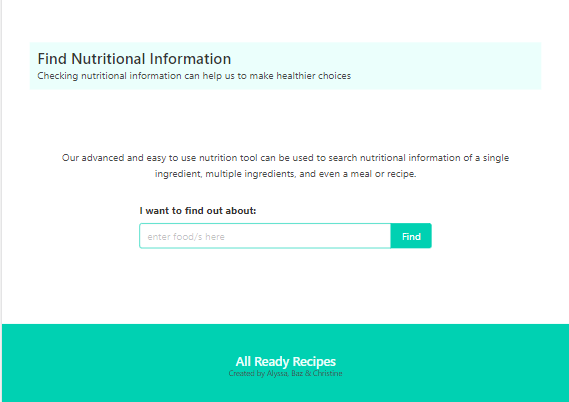
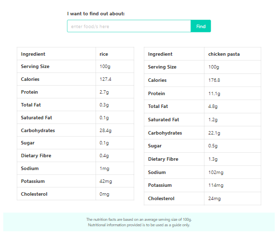

# Nutrition Information Feature

## Description
The nutrition information feature allows a user to input single, or multiple ingredients, meals, recipes and have the nutritional information dynamically displayed on screen to the user. While the Calorie Ninjas API is getting the data from the server, the user is notified with with a loading spinner. 
Visit [All Ready Recipes](https://christinelea.github.io/All-Ready-Recipes/) to see the feature in action.

### USER STORY
AS A visitor to the website I WANT to enter foods/ingredients/meals/serving sizes SO THAT I can check nutritional information

### ACCEPTANCE CRITERIA
GIVEN I want to check nutritional information
WHEN I am on the home page or the recipe suggestion page
THEN I can scroll to the bottom of the pages and view a nutritional info section
WHEN I view this section I can see an input field and a short paragraph on what I can add into the input field
THEN I can type my input into the field
WHEN I press the check nutritional button
THEN the input will be validated to meet the query params of the calorie ninja api
WHEN the validation is complete then the API will use the nutrition endpoint to fetch the data
THEN the nutritional information will be displayed on screen to me
WHEN I view the nutritional information
THEN I will see the following data which was pulled from the fetch request: the “name” of the ingredient , “serving size”, “calories”, followed by (in grams) “sugar”, “fiber”, “saturated Fat”, “total fat”, “protein”, “total carbohydrates”, and in mg “sodium”, “potassium”, “cholesterol” displayed in an HTML table format

## Features
The technologies used in this feature are:
* Calorie Ninjas API
* jQuery ajax to GET the request from the server
* Bulma CSS library
* CSS Keyframe animations

## Visuals

## Installation
N/A
Will require a web browser with internet connection to make use of the application.

## Usage
jQuery will dynamically add the HTML table node elements to display the nutrition information to the user.

## Support
For any questions or to get in touch, please create an issue.

## Roadmap
Future considerations to improve this feature would be to allow the user to store and track their daily nutrition intake.

## Contributing
Not currently accepting any contributions.

## Authors and acknowledgment
This feature was one componenet of our group project, and our first team collaboration. I would like to acknowledge Alyssa and Baz as authors and team members in the overall finished project/front end application.

## License
MIT License

## Project status
Project meets MVP, minimal viable product.
