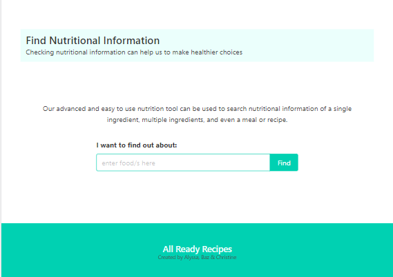
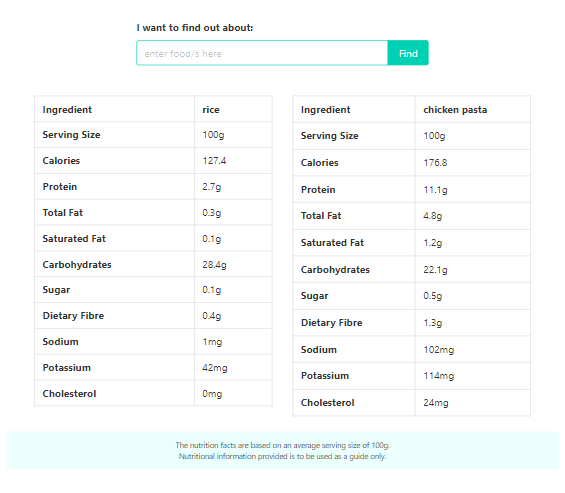
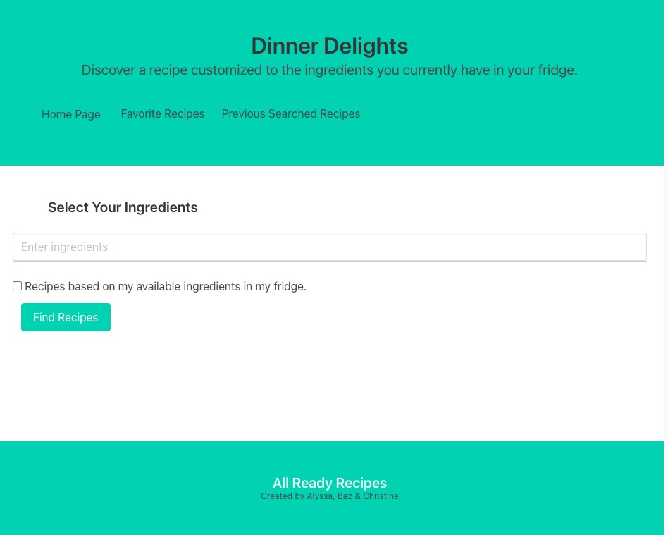
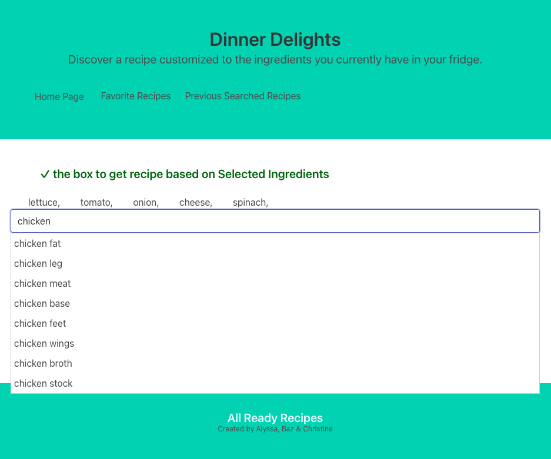
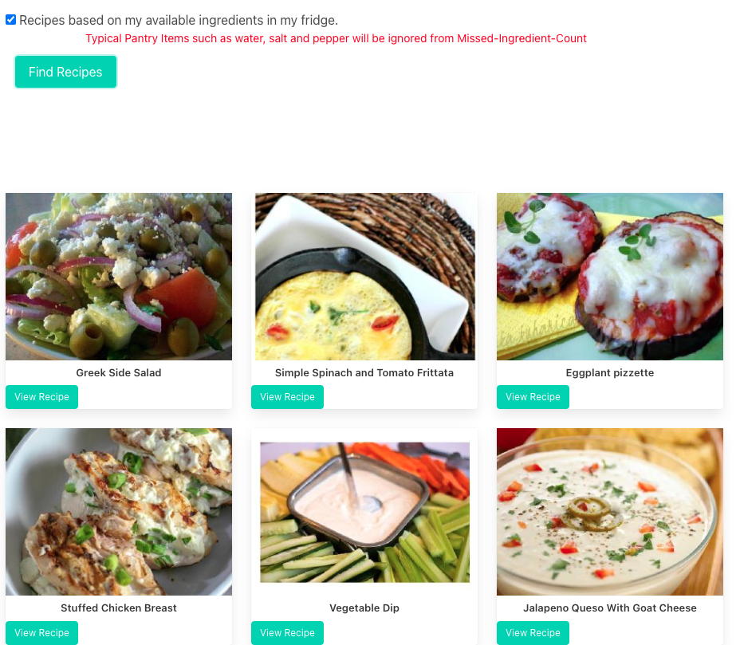
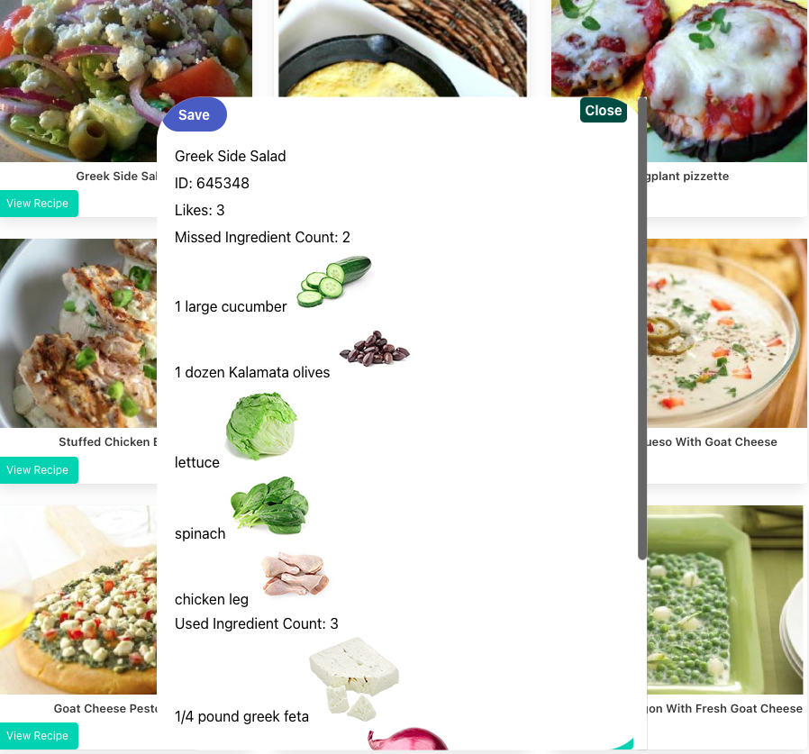

# All Ready Recipes

## Description

Introducing the Recipe Finder App - Discover and explore new recipes made easy! Simply enter the ingredients you have available in your fridge, click on "Find Recipe," and instantly receive a list of delicious recipes based on your ingredients. Save your favorite recipes for later, as they will be stored locally for quick reference. Additionally, delve into more nutrition information to make informed choices about your meals. Embark on a culinary journey and explore a world of possibilities with this Recipe Finder App!

- [GitHub Repository](https://github.com/ChristineLea/All-Ready-Recipes/)
- [Live Demo - HomePage](https://christinelea.github.io/All-Ready-Recipes/)
- [Live Demo - RecipePage](https://christinelea.github.io/All-Ready-Recipes/assets/html/recipe.html)

## HomePage Usage

Visit the [deployed webpage](https://christinelea.github.io/All-Ready-Recipes/) to see the live version.

*Description: Loading nutrition information*

*Description: Displaying nutrition result*

## Recipe-Page Usage/Features

Visit the [deployed webpage](https://christinelea.github.io/All-Ready-Recipes/assets/html/recipe.html) to see the live version.

*Description: The page loads with the title "Dinner Delights" followed by a subtitle, navigation, ingredient selection, checkboxes, and the "Find Recipe" button.*

*Description: Autocompletion suggests ingredient names to the user as they type. This feature improves ingredient selection by providing real-time suggestions powered by the Spoonacular API.*

*Description:
1. Selected ingredients are collected.
2. The checkbox state for "Recipes based on my available ingredients in my fridge" is checked.
3. If the checkbox is checked, the app searches for recipes using only the selected ingredients, ignoring other pantry items.
4. The app determines the ranking and pantry inclusion settings.
5. A request is sent to the Spoonacular API with the selected ingredients, ranking, and pantry inclusion settings.
6. The API responds with recipe results based on the user's preferences.
7. The recipe results are rendered as recipe cards, including the recipe image, title, and a "View Recipe" button.
8. If no recipes are found, a message indicating no recipes were found is displayed.*

*Description:
1. Users can interact with recipe cards, click the "View Recipe" button, and view detailed information about each recipe, including ID, likes, missed ingredient count, unused ingredients, used ingredient count, and instructions.
2. Users can save their favorite recipes by clicking the "Save" button, which adds the recipe to local storage.
3. Users can access their favorite recipes by clicking the "Favorite Recipes" button in the navigation menu.*

## Technologies Used
- HTML: Used for structuring the web pages and elements.
- CSS: Used for styling the application and providing visual enhancements.
- JavaScript and jQuery: Used for implementing interactive functionality and making API requests.
- Bulma CSS Framework: Used as a responsive and modern CSS framework.
- Spoonacular API: Used for fetching recipe data based on user-selected ingredients.
- GitHub: Used for hosting the repository and managing project files.

## Relevant Files
- `./assets/html/recipe.html`: The second HTML page that utilizes autocompletion and fetches recipe data from the Spoonacular API based on user input from the first page.
- `./assets/css/recipe.css`: The CSS file containing styles for both HTML pages.
- `./assets/js/script.js`: The JavaScript file containing the logic and functionality for both HTML pages.
- `README.md`: The readme file providing an overview and instructions for the application.

## Credits to Contributors
- [Christine Lea](https://github.com/ChristineLea)
- [Baz Rahimi](https://github.com/bazrahimi)
- [Alyssa Pidgeon](https://github.com/AlyssaPidgeon)

## License

The code is released under the MIT License. Feel free to use, modify, and distribute it.
